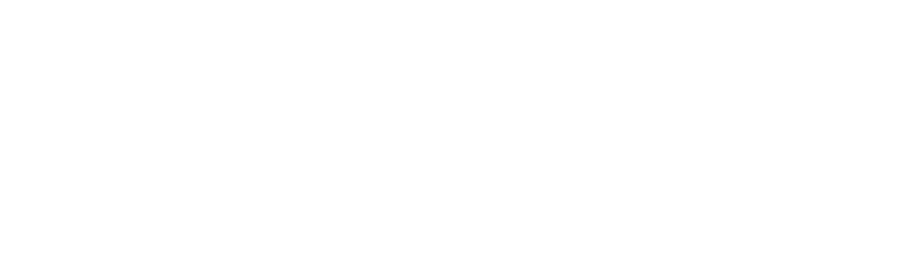
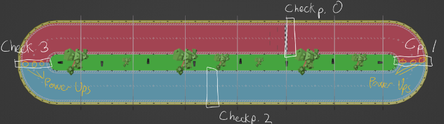
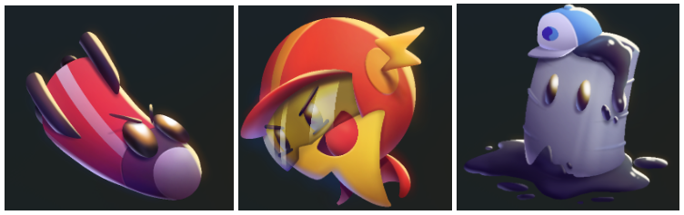
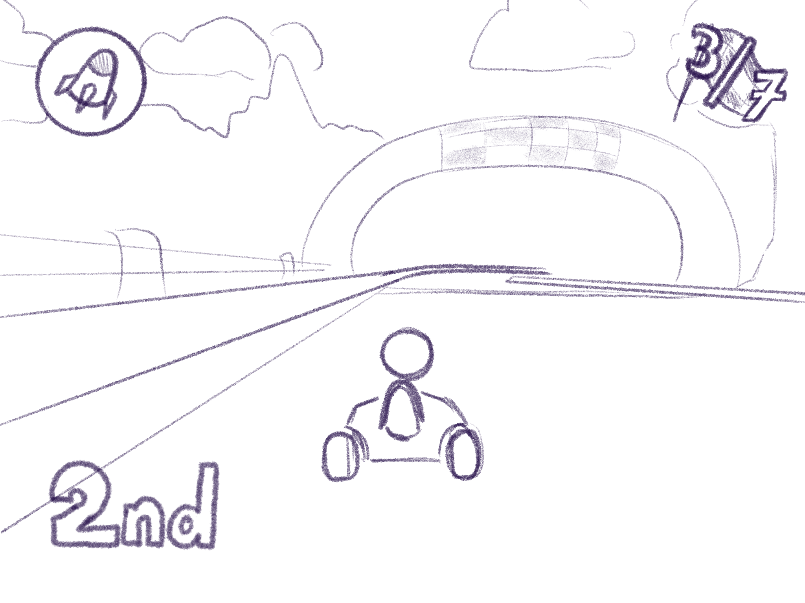
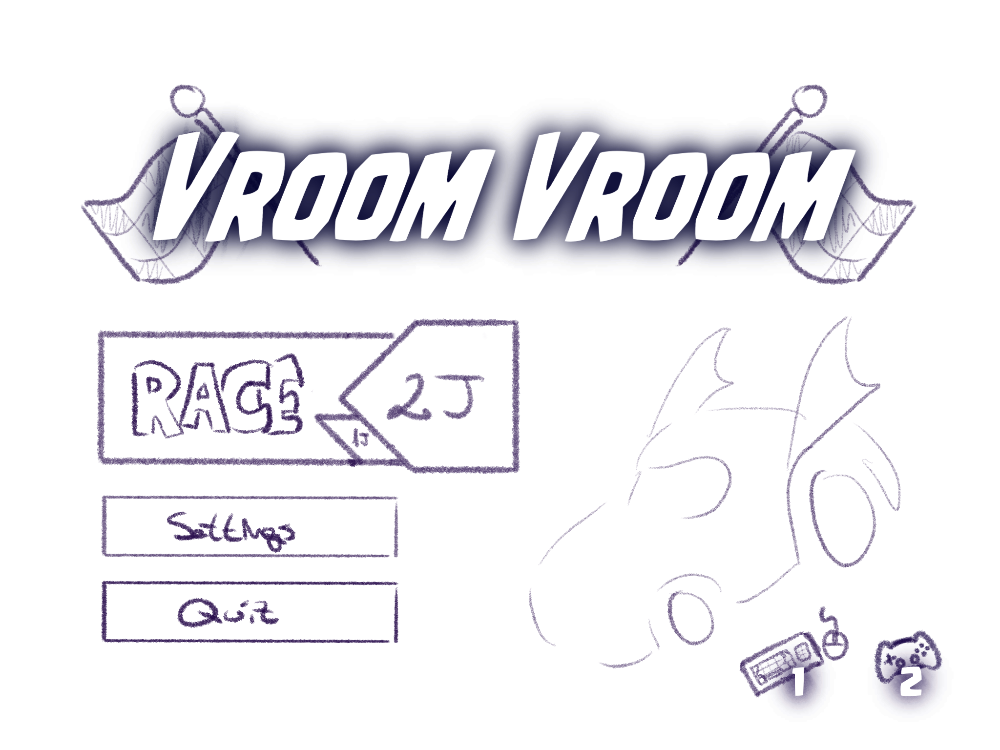
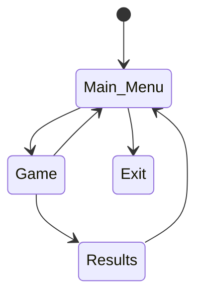
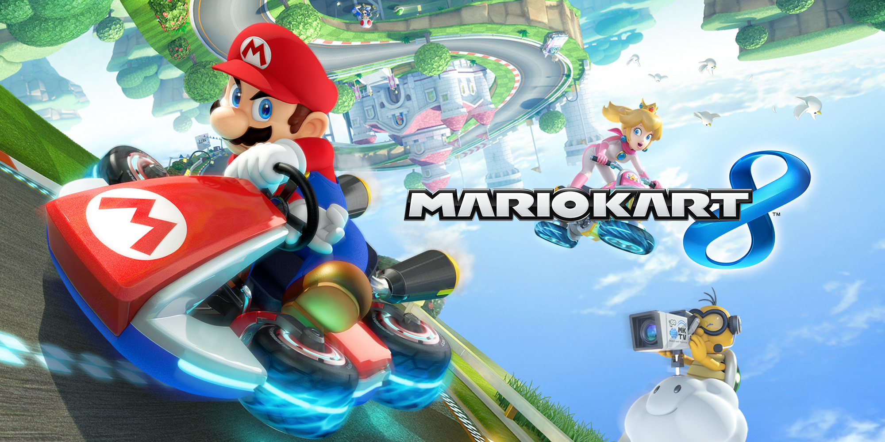
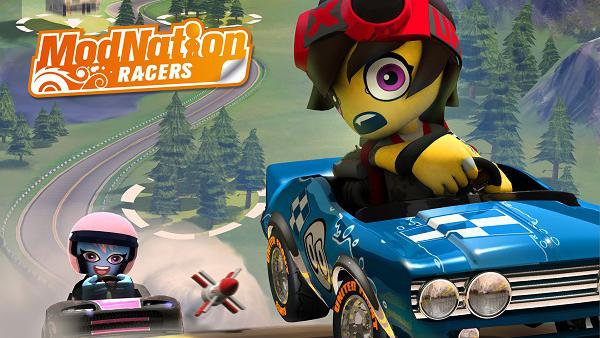

# 
**VROOM VROOM!**

    

## 
**MOTOR ENGINE**

    

* Javier Cano Salcedo, jacano01@ucm.es 
* José Miguel Villacañas, josemv03@ucm.es 
* Pablo Arredondo Nowak, pablarre@ucm.es
* Rodrigo Cabello Hernández, rodricab@ucm.es
* Alfonso Rodulfo Guío, arodulfo@ucm.es
* Diego Rol Sánchez, drol@ucm.es 
* Pedro Pablo Cubells Talavera, pablocub@ucm.es 
* Liyuan Li, liyli@ucm.es

## 
**LINKS DE INTERÉS**

  

## 
**INFORMACIÓN GENERAL**

Juego de carreras desenfadado para retar a tu amigo.

|**Especificaciones**||
| ------ | ----------- |
| Género: | Carreras, Competitivo |
| Plataforma: | Windows |
| Público objetivo:   | Niños entre 7 y 14 años |
| Modos: | Competitivo local entre 2 jugadores y contrarreloj de 1 jugador |
| Cantidades: | 2 coches, 1 circuito, 3 power-ups. |

|**Hitos**| |
| ------ | ----------- |
| 0. Propuesta del concepto: 13 de febrero de 2023  | 1. Arquitectura base: 6 de marzo de 2023  |
|2. Ciclo de juego: 27 de marzo de 2023 | 3. Release: 5 de mayo de 2023 |  

## 
**INSTALACIÓN**

Doble click a buildAll.bat. Cuando la ventana se cierre, descomprimir Vroom_Vroom_x64_Release.zip donde se desee y hacer doble click en Main.exe. ¡Disfruta del juego! :)

## 
**PARTIDA TÍPICA**

Los jugadores conectan sus mandos al ordenador o se colocan en posición para usar el teclado a la vez. Pulsan el botón de 2J. La pantalla se dividirá en 2 mitades, una para cada jugador. Los coches aparecen en la línea de salida y comienza la cuenta atrás.

Comienza la partida y compiten entre ellos para ver quién acaba primero 3 vueltas, haciendo uso de objetos para ir más rápido o molestar al oponente.

Cuando los 2 jugadores llegan a la meta, se muestra el menú de resultados en una tabla que indica los tiempos totales. Al pulsar un botón, vuelven al menú principal.

## 
**CONTROLES**

El juego soporta teclado y mando.

|**Acción**|**Teclado(J1)**|**Teclado(J2)**|**Mando Xbox**|**DualShock 4**|
| ------ | ------ | ------ | ------ | ------ |
| Acelerar | W | Flecha arriba | A | X |
| Girar a la izquierda | A | Flecha izquierda | Joystick | Joystick |
| Girar a la derecha | D | Flecha derecha | Joystick | Joystick |
| Frenar/Marcha atrás | S | Flecha abajo | B | O |
| Usar objeto | Space / E | P / Ctrl Der | LB/RB/X/Y | L1/R1/△/⃞ |
| Volver al menú | ESC | ESC | Start | Options |

## 
**MECÁNICAS**

### **Circuito**

El circuito es el escenario que recorren los vehículos. Tiene forma de 0. Cuenta con una serie de checkpoints para asegurar la correcta vuelta de los jugadores, y evitar que estos traten de realizar la carrera en dirección contraria o saltándose partes del circuito. Hay cajas de objetos repartidas por el escenario, que contienen un power-up, especificados más abajo, estás obsequian al jugador con uno de los tres power-ups, de manera completamente aleatoria.

    

En esta imágen podemos ver cómo se han distribuido los diferentes checkpoints a lo largo del circuito. Empezamos y acabamos en el checkpoint 0 , y es necesario recorrerlos en orden para poder acabar la carrera. Esto es muy importante, ya que sino no nos contará la carrera como finalizada.
También podemos ver como hemos distribuido los power-Ups, tres cajas en cada esquina, esto permitirá que no se abuse de los power-ups en partida, por consiguiente, son suficientes para poder disfrutar de ellos al máximo.

### **Jugadores**

Cada uno de los jugadores manejará un vehículo, con la misma aceleración y una velocidad máxima. El vehiculo del jugador 1 será de color rojo, y de color azul para el coche del jugador 2. El coche sigue un movimiento uniformemente acelerado, con una velocidad máxima y mínima definida por los parámetros del diseño del juego, con un clampeo para poder alcanzar está velocidad máxima o la velocidad mínima de manera lineal, no instantánea. Esto se aplica también a la rotación, la cual sigue el mismo procedimiento para sentir una experiencia de juego fluida y satisfactoria para el jugador. En el caso de estar parados no podremos realizar la rotación del coche.
La cámara se situará en la parte de atrás de cada jugador y le seguirá en todo momento, excepto cuando el jugador es alcanzado por un “Nerf”, en ese caso espera a que el efecto termine, y en ese momento le vuelve a seguir.

### **Power-Ups**

Los power-ups son cubos con los lados de colores que los jugadores podrán recoger durante la carrera. Al ser recogidas, dotan al jugador de un objeto aleatorio, elegido con una ruleta en la interfaz.
Los jugadores solo podrán llevar un power up a la vez de forma que si coge otro se queda el que tiene actualmente y desaparece el power up del circuito.
Los jugadores con power-up podrán usarlo en cualquier momento al pulsar el botón de objeto, siempre y cuando no se le haya quitado el control de su vehículo al jugador por la colisión con otro power-up.
Las cajas desaparecen al ser recogidas y una nueva caja aparece en su misma posición pasados 3 segundos.

### **Mecánicas de escenario**

Solo habrá un elemento del escenario a tener en cuenta
  * Vallas: rodean el circuito para no salirte de forma que si chocas con ella rebotarás un poco hacia atrás y tendrás que redirigir el coche.
  
  
## 
**Dinámica**

El tiempo de una carrera será de aproximadamente 1,30 minutos, siendo el tiempo por vuelta de aproximadamente 22 segundos, siempre dependiendo de la actuación de cada jugador.
En el modo un jugador, el objetivo es tratar de superar el tiempo en cada carrera, tratando de completar el circuito en el menor tiempo posible. 
El juego busca la competición y el inconformismo con uno mismo, de manera que siempre se trate de superarse a uno mismo como su máximo rival.
En el modo dos jugadores, el objetivo del juego es ganar al rival en la carrera. Como se ha explicado anteriormente, se deben aprovechar los Power Ups y conocimientos del circuito para ser más rápido que el rival. Al final de la partida aparecerá el tiempo por vuelta de cada uno de los jugadores.
El juego busca que los jugadores compitan entre ellos y disfruten de la sensación de velocidad y la competición entre ellos. Dada la estructura del juego, es apto para jugadores competitivos o para “casuals” que solo quieran pasar un buen rato.

## 
**Estética**

La estética general del juego está basada en un arte cartoon vectorizada, con una gama de colores saturada y animada. En definitiva, una estética poco agresiva que promueve el aspecto para todos los públicos del juego.
Habrá dos personajes en sus respectivos coches, iguales en geometría pero con una textura diferenciadora.
El diseño de sonido consta de una gama de sonidos cartoon, que representan cada una de las acciones realizadas por el jugador al usar un objeto y coger una caja. También cuenta con música para el circuito, el menú de inicio y resultados. Por último hay sonidos para el comienzo y fin de la carrera y seleccionar botones.

## 
**Contenido**

**2 X Personajes:**
  * **Kart**
  * **Karterine**
  
**2 X Coches**

**1 X Circuito:**

  * **Baby Park:**
    Este circuito tiene forma de 0, tiene amplitud de 8 coches y se completa al darle 7 vueltas. El espacio reducido y la sencillez de este circuito nos proporcionará una gran sensación de frenetismo centrándonos más en coger los power ups para molestar o beneficiarnos.
    
*3 X Power Ups:*
  * **Thunder:**
    Da un impulso a la velocidad del jugador en el momento en el que se activa el power up.
  * **Nerf:**
    Lanza un proyectil hacia delante que hace girar al jugador objetivo, quitándole el control de su movimiento y la posibilidad de usar el power up que tenga. El proyectil avanza en la dirección del jugador que lo lanza y se destruye si se choca con la valla o con el coche.
  * **Oil:**
    Deja una mancha de radio igual al ancho de 1 coche que, al colisionar con un corredor, lo ralentiza y hace deslizar durante un breve periodo de tiempo, quitando a la vez el control sobre su movimiento. La botella de aceite será lanzada al circuito detrás del coche y se quedará tirada en el suelo hasta que alguien colisione con ella.
    

    

    
    
## 
*UI*

En la parte superior derecha podremos ver el tiempo que tardamos en dar cada vuelta, que se mostrará una vez hayamos cruzado la meta en cada vuelta, además podremos ver el número de vuelta en el que nos encontramos y el número de vueltas totales del nivel. Tendremos en la parte inferior izquierda la posición en la que vamos. En la parte superior izquierda podremos ver el power up que tenemos en nuestro arsenal en caso de que hayamos recogido alguno. 

    

## 
*Menús*

**Menú principal :**  En el menú principal podremos encontrar distintos botones
 * **1J/2J :**  Al pulsar alguno de estos botones dará comienzo al juego, ya sea al modo “Contrarreloj / Un Jugador” (1J) como al modo “Dos jugadores” (2J). Al pasar el ratón por encima de alguno de los botones, se resaltará un jugador ( En caso de estar encima del botón 1J) o los dos jugadores ( En el otro caso)
 * **Quit :** Este botón cerrará el juego directamente.
 * **Controller info :** Un par de imágenes pequeñas en la esquina inferior derecha muestran el controlador usado por cada jugador. Si hay mandos conectados, se asigna automáticamente al mando. Si solo hay uno, se le da al jugador 1. A falta de mandos, jugarán con teclado.
 

    

**Menú resultados :** En este menú se nos dará toda la información acerca del tiempo total que hayamos tardado. Además encontraremos un botón que nos permitirá regresar al menú principal, para volver a jugar o poder cerrar el juego.

    

El flujo de juego que encontraremos entre los distintos menús y escenas del juego es el descrito a continuación.

## 
*Referencias y contexto cultural*

 * Saga Mario Kart
 

    

 * ModNation Racers
 

    

 